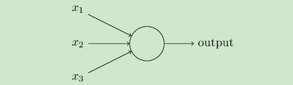

**Introduction**  
Perceptron is also referred to as a single-layer artificial neural network to distinguish it from the more complex multilayer perceptron. As a linear classifier, (single-layer) perceptron can be said to be the simplest form of forward artificial neural network.

The model of perceptron is a model with several inputs and one output, as shown in the following figure:

    

A linear relationship is learned between output and input, and intermediate output results are obtained:

    

Then there is a neuron activation function:

    

To get the desired result 1 or - 1 

The data used in Lecture 3 is

**DataSet**  
- Wheat seed dataset:

  - Similar to iris dataset. The data set contains seed information belonging to three different wheat varieties: Kama, Rosa and Canadian, represented by 1, 2 and 3 respectively
  - Link:https://www.kaggle.com/datasets/jmcaro/wheat-seedsuci
